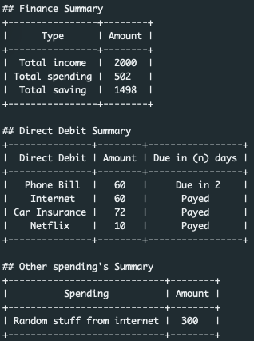

# What Is This ? 🤔

Handy finance calculator that allows one to calculate the `income`, `spending's` and passible savings in a period of current month. Income and spending's are inputted into a `finance-sheet` that provides convenient and once off method of configuration.

There is also an additional feature that will print a summary your spending's to keep them on track. See sample response below.



**Note:** This project is part of my 30min coding challenges. Basically write something fun in 30 minutes in any language. 🤓

## Installation ⚙️

Steps required for initial setup

1. Setup your virtual env
```
python3 -m venv ./env
```
2. Activate it
```
source ./env/bin/activate
```
3. Install dependencies
```
pip3 install -r requirements.txt
```

## Usage 👨‍💻

1. Fill in the `finance-sheet.json` (see sample data for reference)
2. Run the `finance-manager.py` python script : 
```
python3 ./finance-manager.py
```

## Teardown 💣

1. Stop the virtual env
```
deactivate
```

